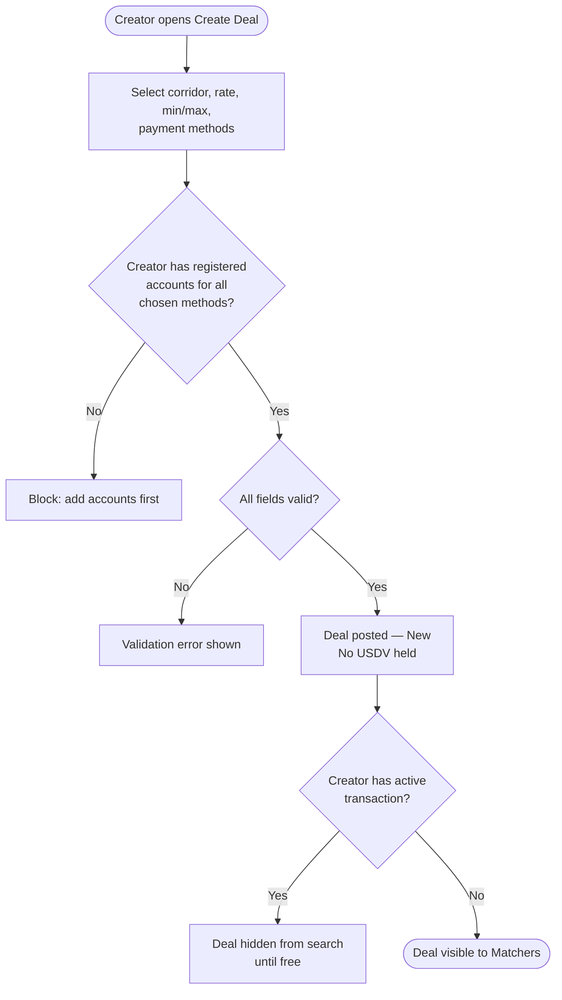
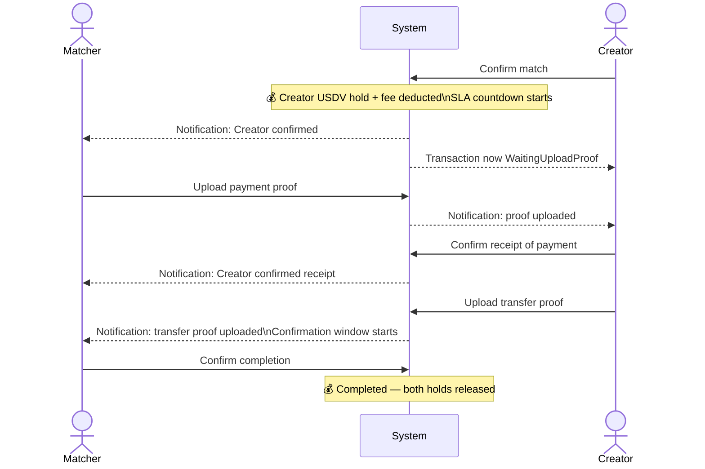
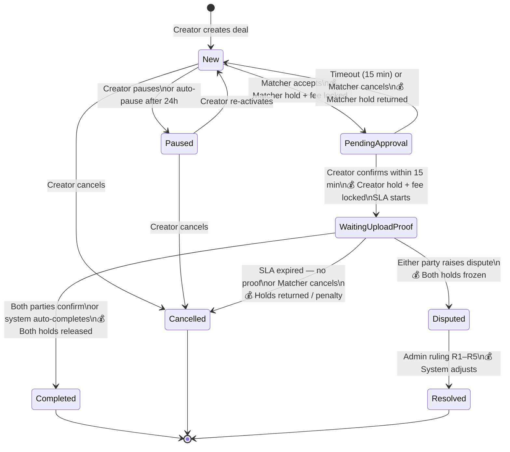

## P2P Remit Deal

**Last Updated:** 2026-06-24
**Audience:** Product Manager, Business Analyst, QA, Customer Support, Operations
**Status:** Approved

---

### Overview

P2P Remit Deal is a peer-to-peer currency transfer feature inside VLinkPay, accessible from the **Exchange Hub**. It enables KYC/KYB-verified members to move money across borders without international wire transfers by matching two parties with complementary currency needs.

A **Creator** — a member who can receive a source currency and pay out the destination currency locally — posts a deal on the platform. A **Matcher** who needs to send money abroad finds a matching Creator deal, accepts it, and the two parties execute two domestic payments on each other's behalf. No international wire transfer is involved; VLinkPay holds only USDV tokens as a security deposit throughout.

> 💡 **Key mechanic:** USDV tokens are locked as a security deposit at two points — when the Matcher accepts a deal, and when the Creator confirms it. They are returned in full on a successful completion, or redistributed according to the dispute outcome or penalty policy.

---

### Key Concepts

| Term | Definition |
| :--- | :--- |
| **Remit Deal** | A standing offer posted by a Creator, specifying the currency corridor, exchange rate, accepted payment methods, and the amount range they are willing to handle. |
| **Creator** | A KYC/KYB-verified member who posts a Remit Deal. The Creator receives the source currency from the Matcher and pays the destination currency to the Matcher's beneficiary. |
| **Matcher** | A KYC/KYB-verified member who accepts a Creator's deal. The Matcher pays the Creator in the source currency and their own beneficiary receives the destination currency. |
| **Beneficiary** | The final recipient of the destination-currency funds. Each party registers their own beneficiary within the deal. Beneficiary details are stored privately in P2P and are not linked to general VLinkPay contacts. |
| **Creator Payment Account** | The external account details (e.g. Zelle number, bank account) registered by the Creator, where the Matcher sends the source-currency payment off-system. |
| **USDV Hold** | A security deposit in USDV tokens locked when the Matcher accepts a deal (Matcher's hold) and when the Creator confirms the match (Creator's hold). Released on completion; redistributed on dispute resolution or penalty. |
| **Corridor** | The currency pair for a transfer, e.g. USD → VND. Each corridor is configured independently by Admin. USD → VND and VND → USD are two separate corridors. |
| **Payment Proof** | A screenshot or document uploaded by a party to confirm they have sent a payment off-system. Proofs are immutable once submitted. |
| **Transfer Proof** | A screenshot or document uploaded by the Creator to confirm they have paid the Matcher's beneficiary in the destination currency. |
| **Memo** | A unique reference code generated by the system and required in every off-system payment to allow reconciliation. |
| **Platform Fee** | 0.5% of the deal amount (in USDV), deducted from both the Matcher and the Creator at the moment the Creator confirms the match. Non-refundable. |
| **SLA** | The time window (configured by Admin) within which both parties must complete their payment actions after the Creator confirms. If the SLA expires with no proof from either party, the deal is cancelled with no penalty. |

---

### User Roles

| Role | Responsibilities |
| :--- | :--- |
| **Creator** | Creates and manages Remit Deals; registers payment receiving accounts per currency/method; confirms or lets incoming matches expire; confirms receipt of payment from Matcher; pays Matcher's beneficiary and uploads transfer proof. |
| **Matcher** | Finds and accepts a matching Creator deal; provides beneficiary details; sends payment off-system to the Creator and uploads payment proof; confirms their own beneficiary received the destination funds. May manage saved payment profiles to speed up deal acceptance. |
| **Admin** | Configures corridors, payment methods, fees, SLA durations, and USDV exchange rates via the backoffice. Reviews all deals, monitors disputes, and issues rulings using outcomes R1–R5. |

> Any KYC/KYB-verified member may be both a Creator (maintaining active deals) and a Matcher. However, a member cannot have more than one active (in-progress) transaction at any time across all roles.

---

### End-to-End Workflows

---

#### Workflow 1 — Creator Creates a Deal

**Primary Actor:** Creator
**Trigger:** Creator wants to offer a currency corridor service to other members.
**Outcome:** A Remit Deal is posted and visible to Matchers with a matching need.

**User Stories:**
- As a Creator, I want to register my payment receiving accounts so that Matchers know exactly where to send money.
- As a Creator, I want to set my own exchange rate and amount limits so that I can manage my risk and availability.
- As a Creator, I want to pause my deal without losing its settings so that I can temporarily stop receiving requests.

**Step A — Register Payment Receiving Accounts**

| Step | Who | Action | System Response | Notes |
| :--- | :--- | :--- | :--- | :--- |
| 1 | Creator | Opens *Receiving Accounts → Creator Accounts* and selects currency and payment method (e.g. USD / Zelle) | System renders required fields for that method (phone, email, account number, etc.) | Must be done before creating a deal for that method |
| 2 | Creator | Enters account details and saves | Account registered; available for use in deals for that currency/method | Each currency/method allows one active account in the current version |

**Step B — Create a Remit Deal**

| Step | Who | Action | System Response | Notes |
| :--- | :--- | :--- | :--- | :--- |
| 1 | Creator | Opens *Manage Deals → Create New*; selects corridor, sets exchange rate, min/max amount, and selects accepted payment methods | System shows only active methods for the selected corridor | Creator must have a registered account for each chosen method |
| 2 | System | Validates fields | If valid, deal is posted with status **New**; no USDV is held at creation | Rate is snapshotted from the Rate table at this moment |
| 3 | System | Deal appears in search results | Visible to Matchers with matching corridor, method, and amount needs | Deal is hidden from search if Creator has a pending or in-progress transaction |

> **Deal visibility rule:** When a Creator has a pending incoming match or an active in-progress transaction, their deal is automatically hidden from Matcher search results. The deal status remains **New** — it reappears as soon as the Creator is free.

---

#### Workflow 2 — Matcher Accepts a Deal

**Primary Actor:** Matcher
**Trigger:** Matcher wants to send money internationally and finds a matching Creator deal.
**Outcome:** Matcher locks the deal and their USDV hold is deducted. Creator is notified.

**User Stories:**
- As a Matcher, I want to search for Creator deals by corridor and payment method so that I find one that matches my situation.
- As a Matcher, I want to save beneficiary accounts so that I don't re-enter details every time.
- As a Matcher, I want to see the exact USDV cost before confirming so that I can make an informed decision.

| Step | Who | Action | System Response | Notes |
| :--- | :--- | :--- | :--- | :--- |
| 1 | Matcher | Opens *Find Deal*; enters amount, source/destination currency, preferred payment methods, and selects a saved beneficiary | System dynamically updates available methods and estimated destination amount | Blocked if Matcher has an active in-progress transaction or a pending unconfirmed match |
| 2 | System | Searches for matching Creator deals | Returns matching deals; Creator names partially masked | Deals where Creator has an active transaction are excluded |
| 3 | Matcher | Selects a Creator deal; reviews full summary on confirmation screen | System shows: amount, corridor, rate, USDV hold amount, and platform fee | Creator's full identity remains masked until they confirm |
| 4 | Matcher | Taps *Accept Deal* | 💰 Matcher's USDV hold + 0.5% platform fee deducted; deal status → **PendingApproval**; Creator notified | If Matcher's USDV is insufficient, acceptance is blocked with no deduction |

> **One pending match at a time:** A Matcher may only have one deal in **PendingApproval** status at any time. Accepting another deal is blocked until the pending one is confirmed, expired, or cancelled.

---

#### Workflow 3 — Creator Confirms Match

**Primary Actor:** Creator
**Trigger:** Creator receives a notification that a Matcher has accepted their deal (deal is in **PendingApproval**).
**Outcome:** Deal moves to **WaitingUploadProof**; both USDV holds locked; both parties see each other's full details; SLA countdown starts.

**User Stories:**
- As a Creator, I want to review the match details (amount, Matcher's payment method, beneficiary method) before committing so that I can confirm I can fulfil the exchange.
- As a Creator, I want to see the exact USDV cost before confirming so that I can decide whether to proceed.
- As a Creator, I want to decline a match I cannot fulfil so that the Matcher can find another deal.

| Step | Who | Action | System Response | Notes |
| :--- | :--- | :--- | :--- | :--- |
| 1 | System | Matcher accepts deal | Deal status → **PendingApproval**; 💰 Matcher's USDV hold + 0.5% platform fee deducted; Creator notified | Creator confirmation window begins (default 15 minutes, configurable via `CreatorConfirmTimeoutMinutes`) |
| 2 | Creator | Opens incoming match; reviews amount, corridor, Matcher's payment method, beneficiary details, and note | System displays Creator's USDV hold amount and platform fee that will apply on confirmation | Matcher's full identity is partially masked at this point |
| 3 | Creator | Taps *Confirm* | System checks Creator's USDV balance | If Creator's USDV is insufficient, confirmation fails; Matcher's hold is returned; deal reverts to **New** |
| 4 | System | Locks the deal | 💰 Creator's USDV hold + 0.5% platform fee deducted; deal status → **WaitingUploadProof**; SLA countdown starts; both parties see each other's full identity and payment/beneficiary details | Creator cannot cancel after this point |
| 4a | System | Creator does not confirm within 15 minutes | Deal auto-reverts to **New**; 💰 Matcher's USDV hold returned in full | Creator's hold was never deducted — no financial impact on Creator |

---

#### Workflow 4 — Executing the Transaction

**Primary Actor:** Both parties
**Trigger:** Deal moves to **WaitingUploadProof** after Creator confirms the match.
**Outcome:** Both off-system payments are made, proofs are uploaded, and completion is confirmed → deal moves to **Completed**.

**User Stories:**
- As a Matcher, I want clear payment instructions (account, amount, memo) so that I transfer the right amount to the right place.
- As a Creator, I want to confirm receipt before disbursing funds so that I am not at risk of paying out without having been paid.
- As a Matcher, I want to confirm my beneficiary received the funds so that I have control over when the security deposit is released.

| Step | Who | Action | System Response | Notes |
| :--- | :--- | :--- | :--- | :--- |
| 1 | Matcher | Transfers source-currency amount to Creator's payment account off-system (exact amount + memo) | — | Must include the system-generated memo reference |
| 2 | Matcher | Uploads payment proof (screenshot/receipt) in the app | Proof recorded; status sub-flag: payment proof uploaded | Up to 3 files; immutable once submitted |
| 3 | Creator | Verifies received amount and memo match; taps *Confirm receipt* | Status sub-flag: payment confirmed | Creator can raise a dispute instead if proof is invalid or amount is wrong |
| 4 | Creator | Transfers destination-currency amount to Matcher's beneficiary off-system | — | Beneficiary details (name, account, memo) shown in full at this step only |
| 5 | Creator | Uploads transfer proof in the app | Proof recorded; status sub-flag: transfer proof uploaded | Matcher is notified; confirmation window begins |
| 6 | Matcher | Verifies beneficiary received the funds; taps *Confirm completion* | 💰 Deal → **Completed**; both USDV holds released immediately | If no action within confirmation window, a reminder notification is sent |
| 6a | System | 24 hours after transfer proof uploaded with no Matcher action | 💰 Deal auto-completes; both USDV holds released | Applies the same financial treatment as a normal completion |

> All actions must occur within the Admin-configured SLA window that starts when the Creator confirms. If the SLA expires with no proof from either party, the deal is auto-cancelled and both holds returned in full with no penalty.

---

#### Workflow 5 — Cancellation Scenarios

**User Stories:**
- As a Matcher, I want to cancel a pending match at no cost so that I can change my mind before the Creator confirms.
- As both parties, I want the system to handle no-show cancellations automatically so that my USDV is never locked indefinitely.

| Scenario | Who Can Cancel | Financial Consequence |
| :--- | :--- | :--- |
| Matcher cancels before Creator confirms (**PendingApproval**) | Matcher | 💰 Matcher's USDV hold returned in full. No platform fee charged. |
| Creator does not confirm within 15 minutes (**PendingApproval** timeout) | System (auto) | 💰 Matcher's USDV hold returned in full. No fee charged. |
| Creator cancels deal before it is matched (**New** or **Paused**) | Creator | No USDV was held — no financial impact. |
| Matcher cancels after Creator confirms, before uploading payment proof (**WaitingUploadProof**) | Matcher | 💰 Platform fee (0.5%) already deducted is non-refundable. Additional cancellation penalty applies per Admin config; split between Creator and platform. |
| SLA expires with no proof from either party (**WaitingUploadProof**) | System (auto) | 💰 Both USDV holds returned in full. Platform fees non-refundable. No additional penalty. |
| SLA expires with at least one proof uploaded but transaction incomplete | No auto-cancel — party with proof may raise a dispute | 💰 Holds frozen until Admin resolves via R1–R5. |

---

### System Configuration & Administration

- As an Admin, I want to configure platform fees and penalty rates so that the cost structure reflects business policy.
- As an Admin, I want to set SLA durations so that members have clear deadlines.
- As an Admin, I want to manage supported corridors and their payment methods so that I can control which markets are active.
- As an Admin, I want to resolve disputes with outcomes R1–R5 and have the system apply the financial adjustments automatically so that manual accounting errors are eliminated.

**Configurable parameters (backoffice):**

| Parameter | Description |
| :--- | :--- |
| Platform fee | Default 0.5% per party (in USDV), deducted at Creator confirmation |
| Creator confirm timeout | Time given to Creator to confirm a match after Matcher accepts (default 15 minutes, `CreatorConfirmTimeoutMinutes`) |
| Cancellation penalty | % of deal value forfeited by the party cancelling after confirmation; split between counterparty and platform per allocation config |
| SLA duration | Total window post-confirmation for both parties to complete all actions (`PostAcceptSlaMinutes`, default 1440 min / 24 h) |
| Confirmation window | Time given to Matcher to confirm completion after transfer proof is uploaded (default ~15 min) |
| Auto-complete delay | Hours after transfer proof upload at which the system auto-completes if Matcher takes no action (default 24 h) |
| Auto-pause delay | Hours a deal sits in **New** state with no Matcher before being auto-paused (`AutoPauseSlaMinutes`, default 1440 min / 24 h) |
| Supported corridors | Currency pairs with their allowed payment methods; USD → VND and VND → USD managed independently |
| Payment methods & banks | Per-token methods and per-method bank list with dynamic required fields; activated/deactivated independently |
| USDV exchange rates | Read automatically from the Rate table at deal creation; snapshotted into the deal — not configured per corridor |

**Admin deal management view capabilities:**

| Capability | Details |
| :--- | :--- |
| Paging | Results paginated for performance |
| Default sort | Newest deal first (by creation date, descending) |
| Filter by status | New, Paused, PendingApproval, WaitingUploadProof, Completed, Cancelled, Disputed, Resolved |
| Filter by corridor | e.g. USD → VND, USD → PHP |
| Filter by member | Deals where a specific member is Creator or Matcher |
| Filter by date range | Created between two dates |
| Flag: Unresolved Dispute | Deal is Disputed with no Admin ruling issued yet |
| Flag: Proof Uploaded — Overdue | Deal is In Progress, proof uploaded, SLA expired, not yet resolved |

---

### State Lifecycle

| Current Status | Trigger | New Status | Notes |
| :--- | :--- | :--- | :--- |
| — | Creator creates deal; fields valid | **New** | No USDV held at deal creation |
| **New** | Creator pauses | **Paused** | Deal hidden from search; active transactions unaffected |
| **New** | Creator cancels / deletes | **Cancelled** | No USDV held — no financial impact |
| **New** | Matcher accepts deal; Matcher's USDV sufficient | **PendingApproval** | 💰 Matcher's USDV hold + platform fee deducted immediately |
| **New** | Auto-pause after 24 h with no Matcher | **Paused** | System job; Creator must reopen to re-list the deal |
| **Paused** | Creator re-activates | **New** | Deal reappears in search |
| **Paused** | Creator cancels | **Cancelled** | No USDV held — no financial impact |
| **PendingApproval** | Creator confirms within 15 min; Creator's USDV sufficient | **WaitingUploadProof** | 💰 Creator's USDV hold + platform fee deducted; SLA starts; full details revealed to both parties |
| **PendingApproval** | Creator does not confirm within 15 min (timeout) | **New** | 💰 Matcher's USDV hold returned in full; Creator's hold never deducted |
| **PendingApproval** | Matcher cancels their acceptance | **New** | 💰 Matcher's USDV hold returned in full |
| **WaitingUploadProof** | Matcher confirms completion (or system auto-completes after 24 h) | **Completed** | 💰 Both USDV holds released immediately |
| **WaitingUploadProof** | SLA expires; neither party uploaded any proof | **Cancelled** | 💰 Both USDV holds returned; platform fees non-refundable |
| **WaitingUploadProof** | Matcher cancels before uploading payment proof | **Cancelled** | 💰 Platform fee retained; cancellation penalty applied to Matcher's hold |
| **WaitingUploadProof** | Either party raises a dispute | **Disputed** | 💰 Both holds frozen pending Admin ruling |
| **Disputed** | Admin issues ruling (R1–R5) | **Resolved** | 💰 System automatically applies the financial outcome |

---

### Business Rules

**Access & Eligibility**
- **KYC/KYB required.** Only members with a valid individual (KYC) or business (KYB) verification may access P2P Remit Deal. The feature has no separate verification flow.
- **One active transaction at a time.** A member may not enter a new transaction — as Creator or Matcher — while any in-progress transaction exists on their account.
- **No self-trading.** A member cannot accept their own deal as Matcher.

**Deal Rules**
- **Deal visibility.** A Creator's deal is hidden from Matcher search results when the Creator has a pending incoming match or an in-progress transaction. The deal status remains **New** — it reappears automatically when the Creator is free.
- **Deal editing.** A Creator may not edit or delete a deal while it has a related pending match or in-progress transaction. Pausing is always allowed.
- **Rate snapshot.** The exchange rate is set by the Creator and locked at deal creation. USDV-to-currency rates are snapshotted from the Rate table at that moment. Subsequent rate changes do not affect active deals.
- **One match at a time per Creator deal.** A Creator deal can only have one pending or active transaction linked to it at a time.

**USDV & Fees**
- **Matcher hold.** When a Matcher accepts a deal, the system deducts 100% of the deal amount (in USDV equivalent) plus a 0.5% platform fee from the Matcher's USDV wallet. If balance is insufficient, the acceptance is blocked.
- **Creator hold.** When the Creator confirms, the system deducts 100% of the deal amount (in USDV equivalent) plus a 0.5% platform fee from the Creator's USDV wallet. If balance is insufficient, the confirmation fails and the match reverts to the Matcher.
- **Platform fee is non-refundable** once deducted at confirmation, regardless of the subsequent outcome.
- **USDV hold is returned** in full on a successful completion or on a no-proof system cancellation.
- **Penalty pre-reserved.** The USDV hold amount already includes a penalty reserve, deducted upfront at the time of lock. The penalty portion is not a separate charge — it is released back to the compliant party or platform from the violating party's locked hold.

> 💡 **Important:** The USDV hold covers the full deal amount plus the platform fee. This guarantees sufficient balance to apply any penalty without checking available balance at the time of the violation.

**Payments & Proofs**
- **All payments occur off-system.** VLinkPay does not transfer fiat currency. The platform provides payment instructions, memo references, and proof upload; the actual transfer happens outside VLinkPay.
- **Memo reference is mandatory.** Every off-system payment must include the system-generated memo for reconciliation and dispute resolution.
- **Proofs are immutable.** Once a payment proof or transfer proof is submitted, it cannot be edited or deleted. Additional evidence may only be added during a formal dispute.
- **Maximum 3 proof files per party.** Each party may upload up to 3 proof files per transaction. Attempting to upload a 4th file returns a validation error.
- **Identity masking.** The counterparty's full name and account details are hidden until the Creator confirms. After confirmation, both parties see each other's full details within the transaction context only.

**Timing & Auto-completion**
- **Creator confirm timeout:** after a Matcher accepts, the Creator has 15 minutes (configurable) to confirm. If no action is taken, the deal auto-reverts to **New** and the Matcher's hold is returned in full.
- **SLA window:** all payment actions must complete within the Admin-configured SLA that starts from Creator confirmation (`PostAcceptSlaMinutes`, default 24 h).
- **Auto-pause:** if a deal remains in **New** state for 24 hours with no Matcher, the system auto-pauses it. The Creator must reopen it to re-list.
- **Auto-cancellation:** if the SLA expires with no proof from either party, the transaction is automatically cancelled and both holds returned.
- **Confirmation window:** after the Creator uploads transfer proof, the Matcher has an Admin-configured window (default 15 minutes) to confirm or dispute. A reminder notification is sent at expiry.
- **Auto-completion:** if 24 hours pass after transfer proof is uploaded with no action from the Matcher, the system auto-completes the transaction and releases both holds.

---

### Dispute Resolution

Either party may raise a dispute when they believe the counterparty has not fulfilled their obligation. Once raised, the deal enters **Disputed** status and both USDV holds are frozen until Admin issues a ruling.

**When disputes can be raised:**

| Condition | Who Can Dispute | Example Reason |
| :--- | :--- | :--- |
| Deal is **WaitingUploadProof**, within the SLA window | Creator or Matcher | Counterparty has not transferred or uploaded proof; amount or memo is incorrect |
| SLA has expired and the party has uploaded proof | The party who uploaded proof | SLA expired; deal incomplete; party can evidence their own payment |

**Admin review process:**

| Step | Who | Action |
| :--- | :--- | :--- |
| 1 | Admin | Opens the dispute case; reviews deal details, both party profiles, beneficiary details, payment and transfer proofs, and the full status timeline |
| 2 | Admin | If evidence is insufficient, contacts the relevant member externally (email, Telegram) to request additional proof |
| 3 | Member | Uploads supplementary evidence directly within the dispute case in the app |
| 4 | Admin | Reviews all evidence and selects one of the preset outcomes (R1–R5) |
| 5 | System | 💰 Automatically applies the financial adjustments of the selected outcome; both parties notified with the final ruling |

> No fixed time limit exists for the Admin to issue a ruling. Both USDV holds remain frozen for the full duration of the review.

**Admin ruling outcomes (R1–R5):**

| Outcome | Meaning | Financial Treatment |
| :--- | :--- | :--- |
| **R1 — Confirm Complete** | Transaction confirmed as successfully completed | 💰 Both holds released; no additional fees |
| **R2 — Matcher Wins** | Matcher is the aggrieved party | 💰 Matcher's hold released + compensation from Creator's hold |
| **R3 — Creator Wins** | Creator is the aggrieved party | 💰 Creator's hold released + compensation from Matcher's hold |
| **R4 — Neutral Cancel** | Mutual agreement or force-majeure cancellation | 💰 Both holds released; no penalty; **platform fees are not refunded** |
| **R5 — Remit Special** | Both parties have valid proofs but a beneficiary receipt is disputed | 💰 Admin selects a sub-preset: **Complete** (as R1), **Matcher Wins** (as R2), or **Creator Wins** (as R3); system applies automatically |

---

### Edge Cases & Exception Handling

| Scenario | What Happens | Who Resolves |
| :--- | :--- | :--- |
| Matcher accepts deal but has insufficient USDV | Acceptance blocked; no USDV deducted; error shown | Matcher (top-up USDV) |
| Creator confirms but has insufficient USDV | Confirmation fails; deal reverts to **New**; no fee charged; Matcher's hold returned | System auto |
| Creator does not confirm within 15 minutes | Deal auto-reverts to **New**; Matcher's USDV hold returned in full | System auto |
| SLA expires with no proof from either party | System auto-cancels; both USDV holds returned; no penalty | System auto |
| SLA expires with at least one proof uploaded but transaction incomplete | No auto-cancel; party who uploaded proof may raise a dispute; holds frozen until Admin resolves | Member (dispute) → Admin |
| Beneficiary's bank rejects the domestic transfer | Creator must retry within the SLA or raise a dispute | Creator → Admin (via dispute) |
| Admin disables a payment method or bank used in an active deal | Active deals unaffected; method hidden from new deal creation only | System — no member action needed |
| Admin disables a corridor | New deals cannot be created for that corridor; active deals continue normally | System — no member action needed |
| Matcher attempts to accept another deal while one is in PendingApproval | Accept flow blocked; app deep-links to the existing pending match | Auto (UX block) |
| Both parties have valid proofs but beneficiary receipt is disputed | Admin uses outcome R5 (Remit Special) and selects the appropriate sub-preset | Admin via R5 |

---

### Frequently Asked Questions

**Q: Does VLinkPay hold my money during the transfer?**
A: No. The actual fiat currency moves directly between members outside VLinkPay — via bank transfer, mobile wallet (Zelle, MoMo, etc.), or another agreed method. VLinkPay only holds USDV tokens as a security deposit to enforce commitments.

**Q: What is USDV and why is it used as a security deposit?**
A: USDV is an internal interest-bearing token within VLinkPay. It is used as a security deposit because it is liquid, consistently valued within the platform, and can be automatically redistributed when penalties apply — without requiring a manual transfer.

**Q: Can I have multiple deals posted at the same time as a Creator?**
A: Yes. A Creator may maintain multiple active deals simultaneously. However, only one deal can have an active (in-progress) transaction at a time. Once a match is confirmed, the Creator's other deals are hidden from Matcher search until the transaction concludes.

**Q: Can I cancel after I've confirmed a match as a Creator?**
A: No. Once a Creator confirms a match, they cannot cancel. If the Matcher fails to upload payment proof within the SLA, the transaction is cancelled automatically with financial consequences for the Matcher. If there is a genuine problem, the Creator should raise a dispute.

**Q: What if my beneficiary doesn't receive the money?**
A: Raise a dispute within the active transaction. Admin will review all payment and transfer proofs and resolve the case using outcomes R1–R5. Outcome R5 is specifically designed for situations where both parties have valid proofs but the beneficiary receipt is in question.

**Q: How is the exchange rate set?**
A: The rate is set by the Creator at deal creation and is fixed for the life of that deal. There is no negotiation. The Matcher accepts the rate as posted when they select a deal.

**Q: When exactly is my USDV held?**
A: The Matcher's USDV hold is deducted the moment they accept a deal. The Creator's USDV hold is deducted the moment the Creator confirms the match. No USDV is held when a Creator simply creates or edits a deal.

**Q: What happens if the Creator doesn't confirm my acceptance?**
A: The Creator has a 15-minute window (configurable) to confirm. If no action is taken, the match automatically expires and the Matcher's USDV hold is returned in full with no fee charged.

---

### Rating System

After a deal reaches **Completed** or **Resolved** status, each party may rate their counterparty.

**How it works:**
- Rating is optional and available once the deal is in a terminal state (Completed or Resolved)
- Each party rates once per deal: 1–5 stars plus an optional text comment
- Ratings are aggregated into a cumulative score visible on each member's public profile (`RemitDealRatingStats`)
- Ratings help Matchers assess Creator reliability and vice versa before committing to a deal

**API endpoints:**
- `POST /api/remit-deal/{id}/rating` — submit a rating for the counterparty
- `GET /api/remit-deal/ratings/{customerId}` — view a member's rating history

---

### Saved Payment Profiles

Members can save beneficiary payment details as reusable profiles to speed up future deal acceptances.

**How it works:**
- A profile stores: payment method type (e.g. Momo, BankTransfer, Zelle, Venmo, AppleCash, PayPal, CashApp) and dynamic field values (account number, account name, bank code, phone number, etc. — varies per method)
- When accepting a Creator deal, a Matcher can select a saved profile to auto-fill their beneficiary details instead of entering them manually
- Profiles are private to the member and not visible to other users
- CRUD operations: create, update, and delete profiles at any time

**API endpoints:**
- `GET /api/remit-deal/payment-profiles` — list saved profiles
- `POST /api/remit-deal/payment-profiles` — create a new profile
- `PUT /api/remit-deal/payment-profiles/{id}` — update a profile
- `DELETE /api/remit-deal/payment-profiles/{id}` — delete a profile

---

### Related Features

- [KYC/KYB Verification](./sign-up.md) — prerequisite for accessing P2P Remit Deal
